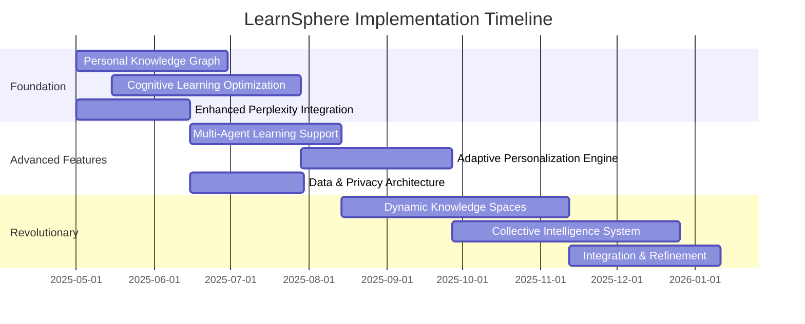

# LearnSphere: Innovation Implementation Roadmap

This document outlines the technical implementation approach for the most transformative features that will set LearnSphere apart as a revolutionary learning platform.

## Phase 1: Foundation Enhancement (Months 1-3)

### 1. Personal Knowledge Graph Implementation

#### Technical Approach:
```
├── backend/
│   ├── services/
│   │   ├── knowledge-graph.service.js  # Core knowledge graph service
│   │   ├── concept-relation.service.js # Manages concept relationships
│   │   └── graph-visualization.service.js # Prepares graph data for visualization
│   ├── models/
│   │   ├── knowledge-node.model.js  # Schema for knowledge nodes
│   │   └── concept-edge.model.js    # Schema for relationship edges
│   └── controllers/
│       └── knowledge-graph.controller.js # API endpoints for graph operations
│
├── frontend/
│   ├── components/
│   │   ├── knowledge-graph/
│   │   │   ├── GraphVisualization.js # Interactive D3-based visualization
│   │   │   ├── ConceptNode.js        # Individual concept node component
│   │   │   └── RelationshipEdge.js   # Relationship edge component
│   └── services/
│       └── graph-interaction.service.js # Client-side graph manipulation
```

#### Implementation Steps:
1. **Knowledge Extraction System**:
   - Implement NLP-based entity and concept extraction from Perplexity responses
   - Develop relationship identification between concepts
   - Create confidence scoring for extracted relationships

2. **Graph Database Integration**:
   - Implement Neo4j or similar graph database connection
   - Develop schema for knowledge nodes and relationships
   - Create indexing for fast graph traversal

3. **Interactive Visualization**:
   - Implement force-directed graph visualization using D3.js or sigma.js
   - Develop zooming, filtering, and exploration controls
   - Create visual differentiation for different types of concepts and relationships

4. **Perplexity API Integration Points**:
   - Extend existing Perplexity service to extract structured knowledge
   - Implement specialized prompts for relationship identification
   - Create feedback loop to improve extraction accuracy

### 2. Cognitive Science-Based Learning Optimization

#### Technical Approach:
```
├── backend/
│   ├── services/
│   │   ├── cognitive-load.service.js    # Estimates user cognitive load
│   │   ├── memory-optimization.service.js # Manages spaced repetition
│   │   └── flow-state.service.js        # Detects and optimizes for flow states
│   ├── models/
│   │   ├── cognitive-profile.model.js   # User cognitive preferences
│   │   └── learning-session.model.js    # Enhanced session tracking
│   └── algorithms/
│       ├── cognitive-load-estimation.js # Algorithms for cognitive load detection
│       └── optimal-challenge.js         # Challenge level optimization
│
├── frontend/
│   ├── components/
│   │   ├── cognitive/
│   │   │   ├── CognitiveLoadIndicator.js # Visual indicator of estimated load
│   │   │   ├── LearningPaceControls.js   # Pace adjustment controls
│   │   │   └── FocusStateMonitor.js      # Monitors attention and focus
│   └── hooks/
│       └── useCognitiveOptimization.js   # React hook for cognitive features
```

#### Implementation Steps:
1. **Cognitive Load Estimation**:
   - Implement timing-based cognitive load estimation
   - Develop complexity analysis for presented content
   - Create interaction pattern analysis to detect confusion or frustration

2. **Memory Optimization System**:
   - Implement adaptive spaced repetition algorithms
   - Develop concept dependency tracking for review prioritization
   - Create multi-modal reinforcement system

3. **Flow State Optimization**:
   - Implement detection of flow state indicators
   - Develop adaptive challenge level adjustment
   - Create distraction minimization features

4. **Perplexity API Integration Points**:
   - Implement dynamic complexity adjustment in prompts
   - Create multi-modal explanation requests based on cognitive state
   - Develop feedback loop for explanation effectiveness

## Phase 2: Advanced Features (Months 4-6)

### 3. Multi-Agent Learning Support

#### Technical Approach:
```
├── backend/
│   ├── services/
│   │   ├── agent-orchestration.service.js  # Manages multiple AI agents
│   │   ├── teaching-agent.service.js       # Specialized teaching agent
│   │   ├── socratic-agent.service.js       # Specialized questioning agent
│   │   └── exploration-agent.service.js    # Specialized exploratory agent
│   ├── models/
│   │   ├── agent-interaction.model.js      # Tracks agent interactions
│   │   └── agent-persona.model.js          # Defines agent personalities
│   └── controllers/
│       └── multi-agent.controller.js       # API endpoints for agent system
│
├── frontend/
│   ├── components/
│   │   ├── agents/
│   │   │   ├── AgentSelector.js            # Interface to choose agents
│   │   │   ├── AgentInteraction.js         # Individual agent interaction
│   │   │   └── AgentFeedback.js            # Feedback on agent performance
│   └── contexts/
│       └── AgentContext.js                 # Manages agent state client-side
```

#### Implementation Steps:
1. **Agent Orchestration System**:
   - Implement agent selection and routing logic
   - Develop context sharing between agents
   - Create feedback mechanisms between agents

2. **Specialized Agent Development**:
   - Implement Socratic questioning agent
   - Develop explorer agent for lateral thinking
   - Create mentor agent for supportive guidance
   - Implement challenger agent for assumption testing

3. **User Interface for Multi-Agent Interaction**:
   - Develop agent switching interface
   - Create visual differentiation between agents
   - Implement conversation threading with multiple agents

4. **Perplexity API Integration Points**:
   - Implement agent-specific prompting strategies
   - Create persona characteristics for different agents
   - Develop conversation memory management

### 4. Adaptive Personalization Engine

#### Technical Approach:
```
├── backend/
│   ├── services/
│   │   ├── personalization.service.js     # Core personalization service
│   │   ├── learning-analytics.service.js  # Analytics for personalization
│   │   └── content-adaptation.service.js  # Content customization
│   ├── models/
│   │   ├── learning-style.model.js        # Expanded learning styles
│   │   └── personalization-profile.model.js # Detailed user preferences
│   └── algorithms/
│       ├── style-detection.js             # Learning style detection
│       └── content-recommendation.js      # Personalized recommendations
│
├── frontend/
│   ├── components/
│   │   ├── personalization/
│   │   │   ├── PersonalizationDashboard.js # User personalization controls
│   │   │   ├── StyleAssessment.js         # Learning style assessment
│   │   │   └── ContentPreferences.js      # Content format preferences
│   └── hooks/
│       └── usePersonalization.js          # React hook for personalization features
```

#### Implementation Steps:
1. **Advanced Learning Style Detection**:
   - Implement interaction-based style detection
   - Develop multi-dimensional style profiling
   - Create adaptive assessment mechanisms

2. **Content Adaptation System**:
   - Implement format transformation for different preferences
   - Develop complexity adjustment based on proficiency
   - Create interest-based relevance enhancement

3. **Neurodiversity Support**:
   - Implement specialized interfaces for different cognitive styles
   - Develop sensory sensitivity accommodations
   - Create executive function support features

4. **Perplexity API Integration Points**:
   - Implement style-specific prompting strategies
   - Create format preference indicators in requests
   - Develop complexity level specifications

## Phase 3: Revolutionary Features (Months 7-12)

### 5. Dynamic Knowledge Spaces

#### Technical Approach:
```
├── backend/
│   ├── services/
│   │   ├── knowledge-space.service.js     # Manages 3D knowledge spaces
│   │   ├── spatial-relation.service.js    # Handles spatial relationships
│   │   └── navigation-support.service.js  # Assists with knowledge navigation
│   ├── models/
│   │   ├── knowledge-space.model.js       # Schema for spatial organization
│   │   └── spatial-anchor.model.js        # Spatial memory anchors
│   └── controllers/
│       └── knowledge-space.controller.js  # API endpoints for spatial features
│
├── frontend/
│   ├── components/
│   │   ├── knowledge-space/
│   │   │   ├── ThreeDimensionalSpace.js   # 3D visualization (Three.js)
│   │   │   ├── SpatialNavigation.js       # Navigation controls
│   │   │   └── ConceptPlacement.js        # Concept positioning
│   └── hooks/
│       └── useSpatialKnowledge.js         # React hook for spatial features
```

#### Implementation Steps:
1. **Spatial Knowledge Organization**:
   - Implement 3D knowledge space using Three.js or similar
   - Develop proximity-based relationship visualization
   - Create semantic clustering algorithms for concepts

2. **Spatial Navigation System**:
   - Implement intuitive 3D navigation controls
   - Develop spatial bookmarking for important concepts
   - Create guided tours through concept spaces

3. **Memory Palace Features**:
   - Implement personal memory palace creation
   - Develop spatial memory association tools
   - Create memorable landmark generation

4. **Perplexity API Integration Points**:
   - Implement spatial relationship extraction from responses
   - Create context awareness of user's position in knowledge space
   - Develop location-specific query enhancement

### 6. Collective Intelligence System

#### Technical Approach:
```
├── backend/
│   ├── services/
│   │   ├── collective-intelligence.service.js  # Aggregates collective knowledge
│   │   ├── insight-detection.service.js        # Detects valuable insights
│   │   └── knowledge-evolution.service.js      # Tracks concept evolution
│   ├── models/
│   │   ├── collective-insight.model.js         # Schema for shared insights
│   │   └── knowledge-contribution.model.js     # User knowledge contributions
│   └── algorithms/
│       ├── insight-quality-assessment.js       # Evaluates insight quality
│       └── consensus-detection.js              # Identifies consensus views
│
├── frontend/
│   ├── components/
│   │   ├── collective/
│   │   │   ├── CommunityInsights.js            # Community knowledge display
│   │   │   ├── ContributionTools.js            # Tools for contributing
│   │   │   └── CollectiveEvolution.js          # Shows knowledge evolution
│   └── contexts/
│       └── CollectiveContext.js                # Manages collective features
```

#### Implementation Steps:
1. **Collective Knowledge Aggregation**:
   - Implement insight extraction from user interactions
   - Develop quality and relevance scoring
   - Create consensus and diversity visualization

2. **Contribution System**:
   - Implement structured contribution mechanisms
   - Develop reputation and trust systems
   - Create attribution and recognition features

3. **Knowledge Evolution Tracking**:
   - Implement concept definition evolution tracking
   - Develop emerging knowledge detection
   - Create trending topic identification

4. **Perplexity API Integration Points**:
   - Implement collective knowledge enrichment in prompts
   - Create feedback loops for response improvement
   - Develop controversial topic identification

## Technical Architecture Upgrades

### Enhanced Perplexity API Integration

#### New Integration Architecture:
```
├── backend/
│   ├── services/
│   │   ├── perplexity/
│   │   │   ├── core.service.js            # Core API integration
│   │   │   ├── prompt-engineering.service.js # Advanced prompt construction
│   │   │   ├── response-processing.service.js # Enhanced response handling
│   │   │   ├── context-management.service.js # Sophisticated context tracking
│   │   │   └── citation-enhancement.service.js # Advanced citation handling
│   └── config/
│       └── prompt-templates/
│           ├── educational-templates.js    # Education-specific templates
│           ├── exploration-templates.js    # Exploration-focused templates
│           └── cognitive-templates.js      # Cognition-optimized templates
```

#### Implementation Steps:
1. **Advanced Prompt Engineering**:
   - Implement dynamic prompt template system
   - Develop context-aware prompt construction
   - Create multi-stage prompting strategies
   - Implement prompt optimization based on response quality

2. **Enhanced Response Processing**:
   - Implement structured data extraction from responses
   - Develop content categorization and tagging
   - Create confidence scoring for extracted information
   - Implement fact verification for critical information

3. **Sophisticated Context Management**:
   - Implement hierarchical context organization
   - Develop long-term context compression techniques
   - Create context importance scoring
   - Implement strategic context pruning

4. **Citation Enhancement**:
   - Implement citation quality assessment
   - Develop citation enrichment from multiple sources
   - Create visual citation presentation enhancements
   - Implement citation verification procedures

## Data and Privacy Architecture

```
├── backend/
│   ├── services/
│   │   ├── privacy/
│   │   │   ├── data-sovereignty.service.js # User data control
│   │   │   ├── privacy-settings.service.js # Privacy preferences
│   │   │   └── anonymization.service.js    # Data anonymization
│   ├── models/
│   │   ├── privacy-preference.model.js     # User privacy settings
│   │   └── data-usage-log.model.js         # Transparent data usage
│   └── middleware/
│       └── privacy-enforcement.middleware.js # Enforces privacy settings
```

#### Implementation Steps:
1. **User Data Sovereignty**:
   - Implement complete user ownership of learning data
   - Develop data export and deletion capabilities
   - Create granular permission controls
   - Implement transparent data usage logging

2. **Privacy-First Analytics**:
   - Implement differential privacy techniques
   - Develop on-device processing options
   - Create anonymized aggregation methods
   - Implement federated learning approaches

3. **Ethical AI Framework**:
   - Implement bias detection in responses
   - Develop fairness monitoring systems
   - Create transparency in AI decision processes
   - Implement value alignment verification

## Integration Timeline and Dependencies



## Success Metrics and Evaluation

1. **Learning Effectiveness Metrics**:
   - Knowledge retention improvement percentage
   - Concept application success rate
   - Learning time efficiency gains
   - Depth of understanding assessments

2. **User Experience Metrics**:
   - Flow state achievement frequency
   - Self-reported satisfaction scores
   - Feature utilization patterns
   - Return user percentage and frequency

3. **Technical Performance Metrics**:
   - Response generation time
   - Knowledge graph accuracy rates
   - System reliability measurements
   - Scalability benchmarks

4. **Impact Metrics**:
   - Educational outcome improvements
   - Real-world knowledge application
   - User capability development
   - Learning confidence gains

This implementation plan transforms LearnSphere from a conventional learning platform into a revolutionary knowledge ecosystem that fundamentally changes how people interact with information and develop understanding.
